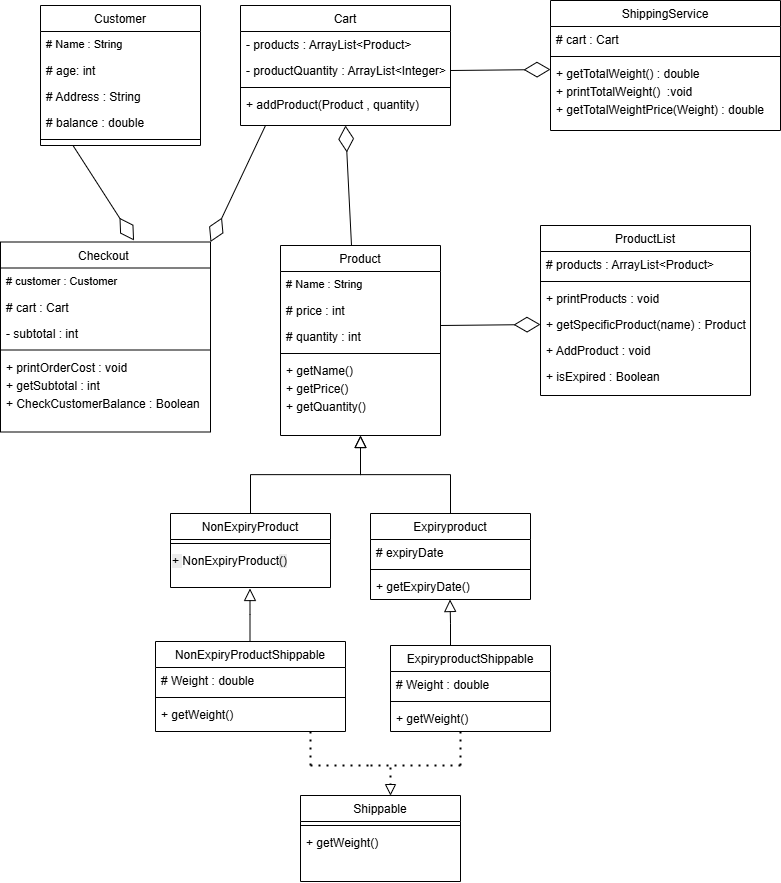

# Fawry Task

Hello Dear , This is my pleasure to take this task.The Task was insightful and I do my Best for covering all the mentioned and not mentioned Corner Cases.

## UML Diagram
I Tried my best to make the solution strict to principles of Object Oriented Design.The solution is concerned about making the classes not tightly coupled but have a high cohesion and this is my Class Diagram. 

