# Fawry Task

Hello Dear , This is my pleasure to take this task.The Task was insightful and I do my Best for covering all the mentioned and not mentioned Corner Cases.

## Screens from Console App
**I make the app more dynamic by making the customer choose from the list**

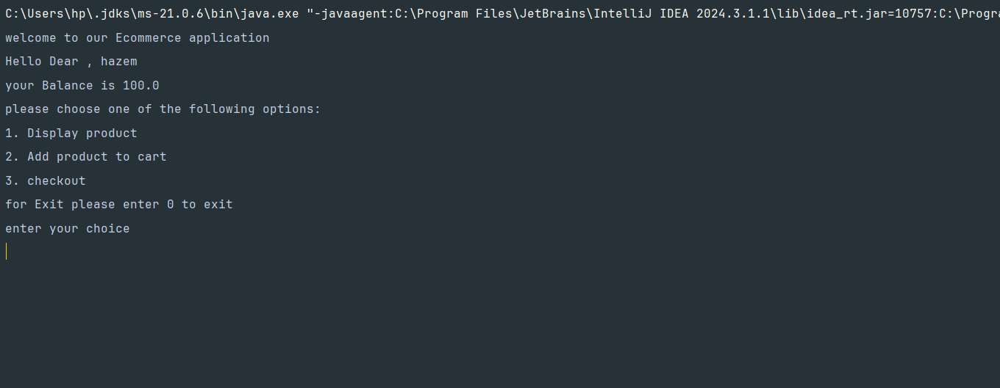
---
**code example for list the products**
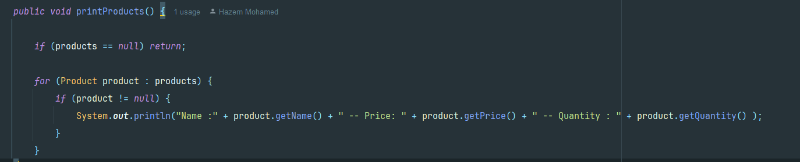
**This our products after choosing product list**
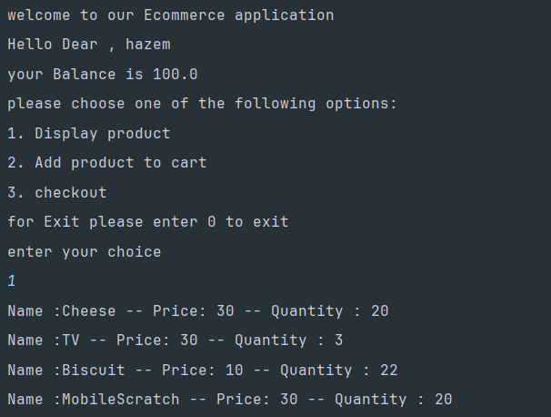
---

**code example for add to cart**
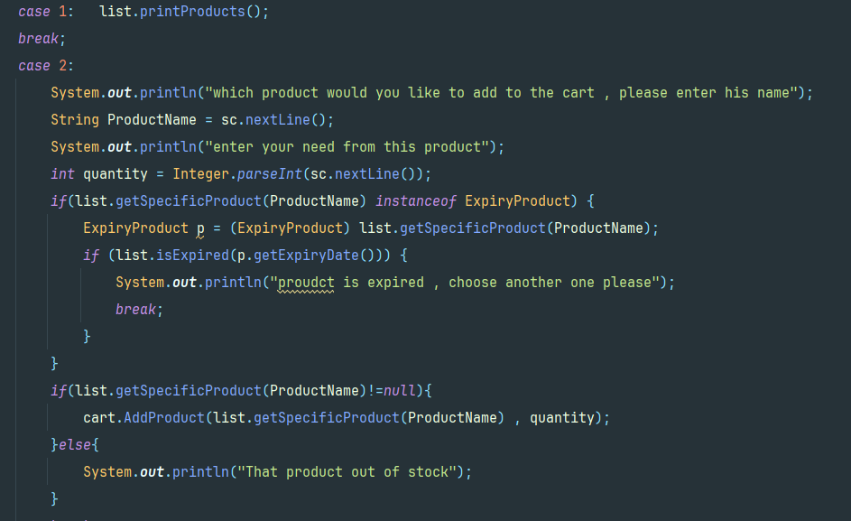
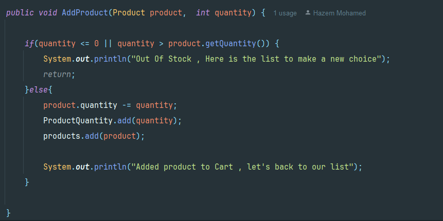

**Add to cart (successful scenario)**
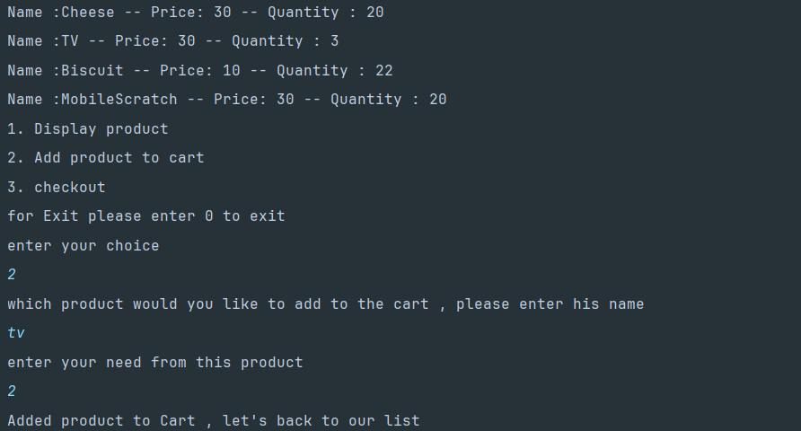
---

**code example of order proceeding**
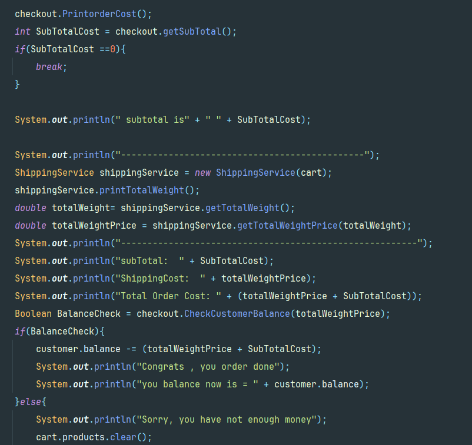

**Order proceed (successful scenario)**
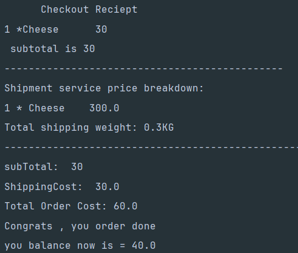
---

**code example for empty cart case**
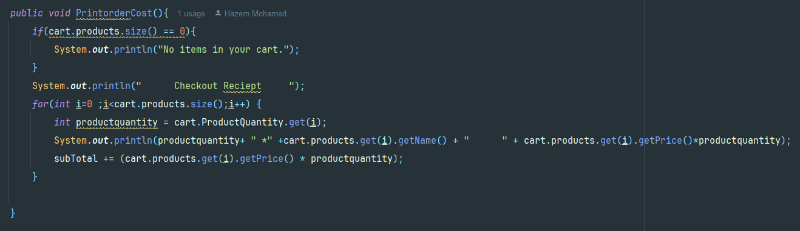

**Corner case for empty cart**
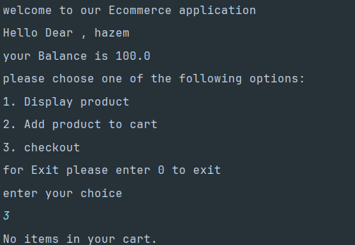
---
**code example Corner case for product expiration**
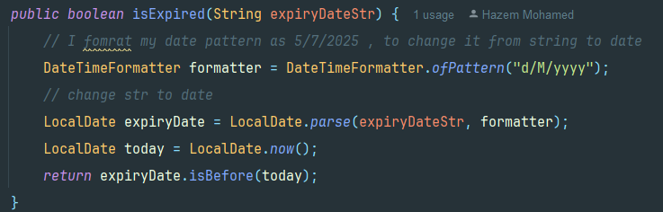

**Corner case for product expiration**
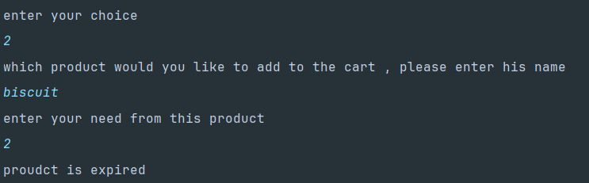
---
**code example for Corner case for out of stock**

**Corner case for out of stock**
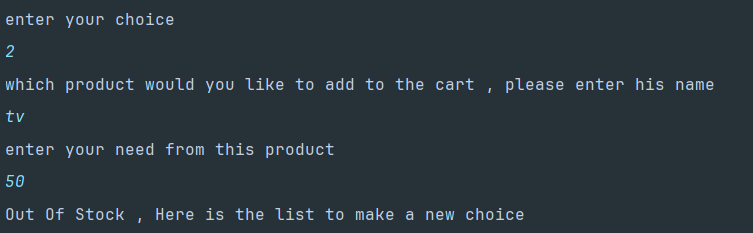
---
**code example for Order not proceed due to insufficient balance**
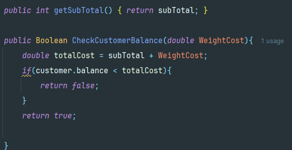

**Order not proceed due to insufficient balance**
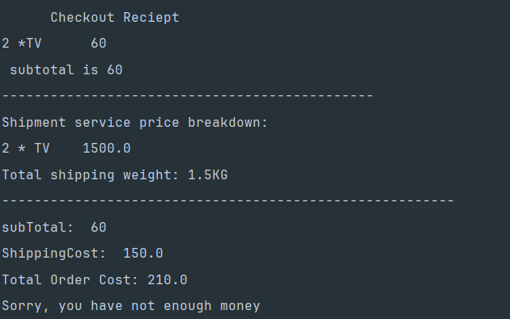
---

## UML Diagram
I Tried my best to make the solution strict to principles of Object Oriented Design.The solution is concerned about making the classes not tightly coupled but have a high cohesion and this is my Class Diagram. 

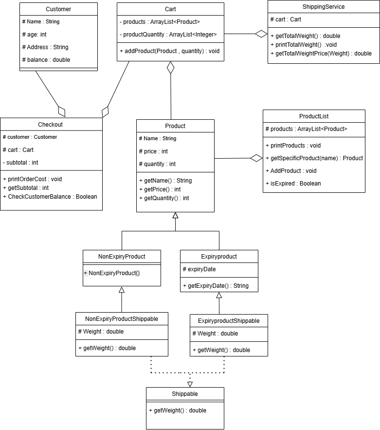

## brief about each class 

**I have made my Best for making each name for each class , method , attribute reveal its intention and has class naming Convention**

**Customer Clas**s:  has attributes like name , age , address , balance. **balance will use in cases of checkout to check the balance**.

---
**Product Class** : has attributes like name , price , quantity. this class will be used as **parent class for different types of products**. **also has aggregation relationship with ProductList class to show the list of predefined product , has method for getting values only**.

---

**ProductList Class** :  it has the predefined products in his list. and **responsible for printProducts() for printing the product , return getSpecificProduct() to be added , within this function check corner cases of not having the product or it is out of stock it also lowercase the input of user to compare it and not make any conflict , addproduct() this is responsible for adding products , isExpired() fucntion is responsible to check expiry date of the product before making cart added it**.

---

**ExpiryProduct Class**: is a class that extend the product class but add one attribute for the expiry date , one more method **for getting expirydate**.

---

**NonExpiryproduct Class**: **is a class extend the Product Class**.

---

*Shippable Interface* :  is an Interface that should the product that need to be shipped to implement it , has one method get Weight , **I do not put getName() as the classes already extend it from Product Class**

---

**NonExpiryproductShippable Class** : is a class extend the Product Class and **implement the Interface Shippable for be able to know type of this product to calculate shipping cost**.

---

**ExpiryProductShippable Class**: is a class that extend the product class  and **implement the Interface Shippable for be able to know type of this product to calculate shipping cost**. 

---

**Cart Class** : **has arraylist for product and I have made another arraylist for quantity to overcome the problem of updating the quantity of object with the need of customer so i keep track of cutomer need and minus it from the original product quantity with no conflicts. has method for adding product in which take the product and quantity customer need**

---

**Checkout Class** : **has aggregation with customer and cart. this class responsible for print order cost through PrintOrderCost() , return the subtotal before calculating if the product has shipping cost or not throgh getSubtotal() , check customer balance before proceeding the checkout through CheckCustomerBalance()**

---

**ShippingService class** : **has aggregation with cart , calculate the weight for the product in the cart that implement shippable ,  getTotalWeight() for return weight in receipt and  getTotalWeightPrice() for return the price for all weight (for each gram = 0.10) , printTotalWeight() for printing total weight for all product**.

---

